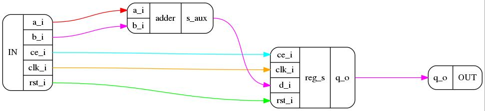

MyHDL to DOT
============

Descripcion :
-------------

Modulo de Python que permite generar un conjunto de
diagramas en bloques, a partir de la descripcion en MyHDL
de un dispositivo de hardware. 
Este conjunto de diagramas documenta la dependencia e 
interconexion de los submodulos del dispositivo.

Requisitos :
------------

* myhdl
* pygraphviz

Instalacion :
--------------
```
sudo python setup.py install
```

Ejemplo de uso :
----------------

```python

from myhdl import * 
from myhdl2dot import myhdl2dot 
from reg_adder import reg_adder

clk = Signal(False)
rst = Signal(False)
ce = Signal(False)
a = Signal(intbv(0)[4:])
b = Signal(intbv(0)[4:])
q = Signal(intbv(0)[4:])

top_mod = myhdl2dot("./", "jpg", reg_adder, clk, rst, ce, a, b, q)

```



```python

top_mod.show_tree()
```

```
           |In : a_i, b_i, ce_i, clk_i, rst_i
reg_adder--|
           |Out : q_o
 |  
 |         |In: ce_i, clk_i, d_i, rst_i
 |_ reg_s--|
 .         |Out: q_o
      |  
      |       |In: ce_i, clk_i, d_i, rst_i
      |_ rtl--|
      .       |Out: q_o
 |  
 |         |In: a_i, b_i
 |_ adder--|
 .         |Out: s_aux

```

